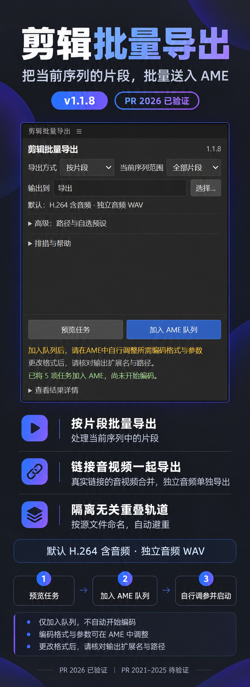

# Premiere ClipOut · 剪辑批量导出

Premiere Pro 中文 CEP 面板：把当前序列中的剪辑片段批量加入 Adobe Media Encoder 队列，减少逐项设置的操作。

它适合“时间线上有很多片段，想分别导出成文件”的场景。先在 Premiere 中整理好序列，选定要处理的片段和输出位置，面板会预览任务，并把每项送入 AME。你仍在 AME 中检查参数、决定什么时候开始编码。它不是独立剪辑软件，也不需要上传视频到云端。

*上图基于 1.1.8 真实截图经 AI 重绘，是旧版界面宣传示意；当前 1.1.9 以实际面板为准，自选预设控件已移除。*

## 能做什么

- 按片段导出当前序列中的已选片段或全部片段；保留按标记区间导出模式。
- 真正链接的视频与音频合并导出；未链接音频独立导出，每项只包含自己的素材。
- 固定 H.264 匹配序列、高码率、含音频；独立音频为 WAV 48 kHz / 16-bit。
- 记住输出文件夹，用户自行选择位置。预览任务后再加入 AME 队列。
- **只入队，不自动开始编码。** 可在 AME 调整参数；更改格式后核对文件扩展名和路径。

## 本修改版的整理与增补

在原仓库基础上，这个修改版提供了中文紧凑面板、任务预览和排错说明；整理了按片段处理时真实链接 AV 合并、未链接音频独立隔离的流程，同时保留原标记模式。

1.1.9 简化了格式操作：移除自选预设控件，固定 H.264 与 WAV，并自动读取本机 AME 的系统预设。另提供 Windows 图形化安装、卸载和回滚，旧插件先备份，避免用户手动复制目录或运行脚本。本轮仅改名为 Premiere ClipOut，导出核心未重写。

## Windows 安装、卸载与回滚

当前版本 **1.1.9**。EXE 包文件名为 `Premiere-ClipOut-1.1.9-Windows-EXE-20261002.zip`，含安装器、卸载器、中文说明、完整 MIT 与 SHA256。

1. 保存工程，自行关闭 Premiere 和 AME。
2. 解压 EXE 包，双击 `Install-Premiere-ClipOut-1.1.9.exe`。无需 Python、Node 或运行脚本；需要 Windows x64 和 .NET Framework 4.8。
3. 打开 PR，在“窗口 → 扩展”打开 **Premiere ClipOut · 剪辑批量导出**，选择输出文件夹，预览或入队。

安装到当前用户 `%APPDATA%/Adobe/CEP/extensions/com.texs.markerexport`。同名旧版先备份，其他插件不删除或覆盖。稳定扩展 ID 保持 `com.texs.markerexport`，便于从旧版升级。

若加载未签名 CEP 需要修改共享 `PlayerDebugMode`，安装器会明确询问；拒绝则取消安装。它检测 Premiere 自带 CEP 版本，记录原值和类型，修改后核对为 `REG_SZ "1"`；不会修改 PowerShell 安全策略。

卸载可通过 Windows“已安装的应用”，或 `Uninstall-Premiere-ClipOut-1.1.9.exe`。仅处理此安装器管理、文件校验一致的插件；遇到后来改动的文件或设置会保留并停止相应操作。卸载文件和旧版备份保留，安装窗口的“恢复上一版本”可回滚。共享 CEP 调试标志默认保留，明确同意且设置未被后来改动时才恢复。

## 本机 AME 预设

源码与安装包都不附带 Adobe `.epr`。插件只读使用用户本机 AME 2026 的 H.264 / WAV 系统预设，安装器先检查它们存在且 XML 可读，缺失时阻止安装。

支持默认 `Program Files/Adobe` 目录，以及与 Premiere 同级的 `Adobe Media Encoder 2026` 目录；其他独立自定义 AME 目录尚不支持自动发现。代码中没有本机用户名或生产输出目录硬编码。

## 验证范围

- PR 2026 已有核心 1.1.4 的原生实测基线，1.1.8 旧界面已由用户运行。
- **1.1.9 的本机预设发现与导出路径尚待 PR 原生验收**，不能把原核心或旧界面的实测结论当作新版原生验收。
- 改名后通过 23 项前端检查、22 项命名与逻辑不变检查、35 项隔离安装／卸载／回滚测试，以及真实环境只读检测。注册表写入测试使用内存模拟；没有覆盖当前生产插件或运行用户 AME 队列。
- **PR / AME 2021–2025 待测**，当前安装器仅允许 2026 组合。现有 CEP 清单不含 2021 范围，22–25 也未宣称兼容；未来需要逐版本验证。

## 从源码构建

Windows PowerShell 中运行 `./installer/Build.ps1`，使用系统已有 .NET Framework C# 编译器生成两个 EXE，不下载新构建依赖。

生成的 EXE `--sandbox-test <当前目录下的隔离路径>` 可做模拟注册表的安装器验证；`--probe <当前目录下的报告.xml>` 只读检测环境，并绘制安装器自身窗口预览。开发检查不会启动 Adobe。

## 来源与许可证

源自 [Tex Jernigan / premiere-marker-export](https://github.com/texjer/premiere-marker-export)，上游基线提交 `72bb03a095b6dbd7c5e9d1037387438f71ad0772`。

保留原作者 **Copyright (c) 2026 Tex Jernigan** 与完整 [MIT LICENSE](LICENSE)，补充来源见 [NOTICE.md](NOTICE.md)。MIT 适用于本项目代码，不对 Adobe 系统文件重新授予许可。

感谢 **texjer / Tex Jernigan** 开源原插件，让这个修改版能在其工作基础上继续整理和改进。原仓库：[texjer/premiere-marker-export](https://github.com/texjer/premiere-marker-export)。这里保留原作者版权与来源，不把上游成果表述为全部由本修改版原创。

用普通话说，MIT 允许你使用、修改、复制和分发项目代码，包括商业使用；分发代码或其重要部分时，须保留版权声明和许可证。软件按现状提供，不附带担保。请以 [完整 LICENSE](LICENSE) 为准。这份代码许可不额外授权 Adobe 商标、程序库或其他 Adobe 资产，宣传图的使用也不改变这些边界。

仓库名为 `premiere-clipout`；名称不代表声称独有。本源码不包含私人课程、工程、媒体、运行日志、凭据、安装备份或 Adobe 程序库。
