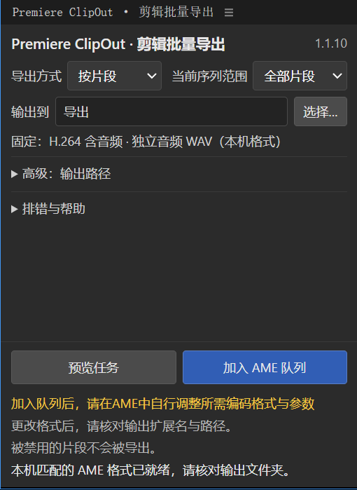

# ClipOut 1.1.10

Premiere Pro 的中文 CEP 剪辑批量导出面板。**支持 Premiere Pro 2021–2026**，当前版本为 1.1.10 预发布。

运行要求：Windows x64，Premiere Pro 与 Adobe Media Encoder 使用相同主版本，并已安装本机 H.264／WAV 系统预设；补丁号无需一致。

[截图说明](docs/promo.md)：当前 1.1.10 的真实插件面板，仅裁取插件区域。

## 使用

选择导出方式、当前序列范围和输出文件夹，先预览，再加入 AME 队列。被禁用的片段不会被导出，具体原因仍显示在结果详情中。只入队，不自动启动编码；请在 AME 中核对格式、参数、输出扩展名和透明通道。

面板自动读取本机对应版本 AME 的 H.264 含音频与 WAV 系统预设，不提供预设管理器，不随包附带 .epr 文件。输出目录由用户选择并记忆，不硬编码某台机器的输出路径。

## 导出范围

按片段时，在父序列的原生副本中保留目标和通过官方链接 API 双向确认的关联音频，保留精确入出点。未链接音频独立导出；marker 模式仍按标记区间导出序列完整混合。

支持无 ProjectItem 的已识别原生图形、经唯一方向与边界证据确认的单边转场，以及嵌套／多机位的父序列实例。原生效果、关键帧和转场由 Premiere 克隆保存，不从 XML 重建。图形入场在 XML 中可能被写成通用转场名称，原生转场仍保持不变。AME 完成前不要修改引用的源序列，也不要删除导出副本。

父序列独立调整层及其效果可忽略；嵌套内部调整层保留。不自动加入无真实链接的背景音乐、其他重叠轨道或外部字幕。

## 已知功能限制

- 双边或未分类转场需要邻接素材上下文，当前明确跳过。已识别的 Track Matte／Set Matte 跨轨遮罩也明确跳过。没有通用第三方效果依赖解析器，不能承诺任意跨轨效果都能独立保真。
- 输入边界、实际链接、启用状态或转场方向无法唯一确认时，显示具体跳过原因，其他有效任务继续。

## Windows 安装、卸载与回滚

从 Releases 下载 ClipOut-1.1.10-Windows.zip，解压后先保存并关闭 PR 和 AME，再运行 Install-ClipOut-1.1.10.exe。安装器仅写入当前用户 APPDATA/Adobe/CEP/extensions/com.texs.markerexport，完整备份同名旧版，不删除其他插件。

如需启用未签名 CEP 调试，安装器会明确请求用户交互同意；不会静默修改共享设置或 PowerShell 安全策略。安装后在 PR 的“窗口 → 扩展”打开 Premiere ClipOut。

运行 Uninstall-ClipOut-1.1.10.exe 或 Windows 应用卸载入口可卸载；安装器也提供回滚至已备份旧版。不要在 AME 尚需引用导出副本时清理工程副本。

## 从源码构建与检查

Windows 自带 .NET Framework C# 编译器可构建安装程序，无须下载依赖：

powershell.exe -NoProfile -File installer/Build.ps1

在已安装 Node.js 的环境运行：

node --test tests/export.test.cjs tests/bridge-current.test.cjs

node tests/frontend.test.cjs

核心导出行为与桥接有 125 项回归，前端另有检查；安装器提供 --sandbox-test 指定独立沙盒目录以检查备份、卸载与回滚，不操作生产 Adobe 队列。

对外版本统一为 1.1.10；详细诊断中保留内部构建标识用于定位，不作为对外版本后缀。MIT 许可证及上游署名见 LICENSE、NOTICE.md。
