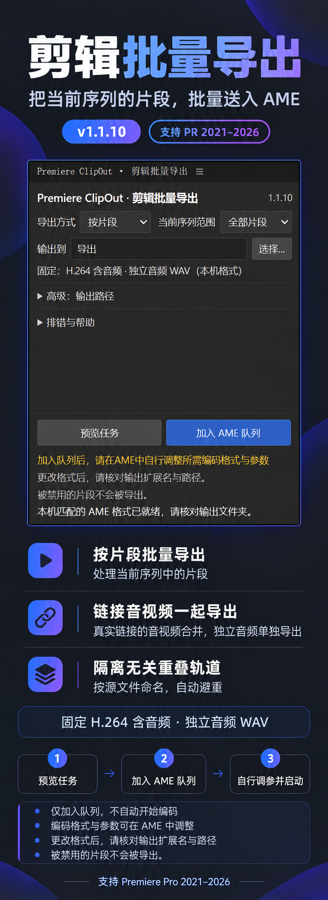

# ClipOut 1.1.10 展示图与面板实拍

支持 Premiere Pro 2021–2026。需要 Windows x64，以及与 Premiere Pro 相同主版本的 Adobe Media Encoder；补丁号无需一致。

展示图沿用原蓝紫排版，基于当前 1.1.10 的真实面板截图通过图片编辑制作，包含版本、支持范围、功能说明和操作流程。面板固定读取本机 H.264／WAV 格式，并显示“被禁用的片段不会被导出”提示。

原始面板实拍另行保留，只裁取插件区域，没有重绘界面；不含工程素材、个人路径或日志：

只加入 AME 队列，不自动启动编码。双边或未分类转场及已识别的跨轨遮罩依赖当前跳过；其余功能说明见 [README](../README.md)。
