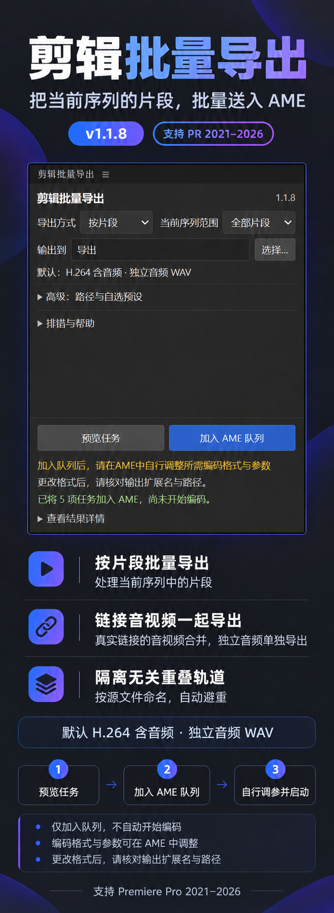

# ClipOut 宣传图

支持 Premiere Pro 2021–2026。需要 Windows x64，以及与 Premiere Pro 相同主版本的 Adobe Media Encoder；补丁号无需一致。

此图基于旧版 1.1.8 界面示意，通过图片编辑更新支持范围文案。图中历史版本号及界面布局保留；当前 1.1.10 已移除自选预设，固定读取本机 H.264／WAV 格式，实际界面以插件为准。

只加入 AME 队列，不自动启动编码。双边或未分类转场及已识别的跨轨遮罩依赖当前跳过；其余功能说明见 [README](../README.md)。
